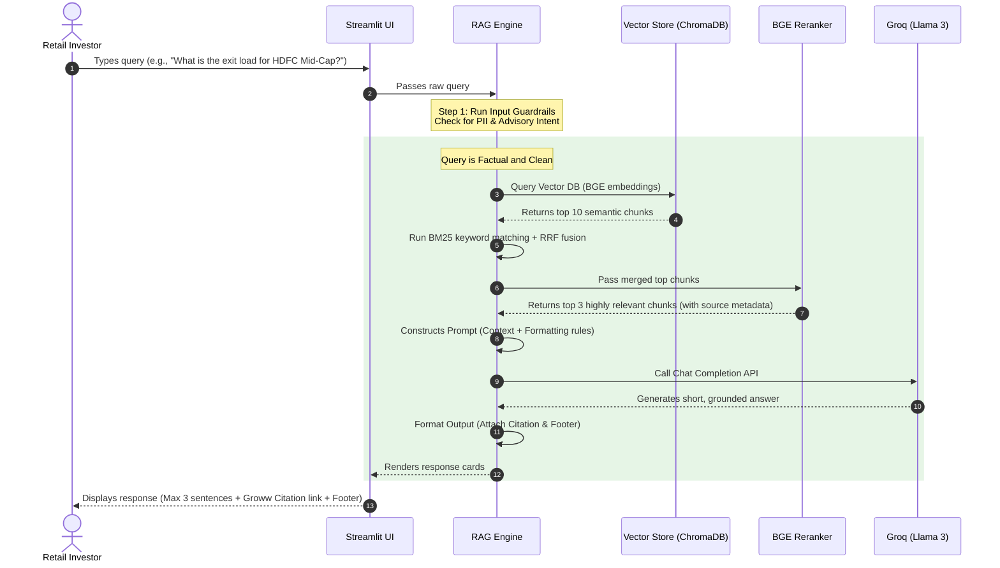

# System Architecture: Mutual Fund FAQ Assistant (MFRagChatBot)

This document details the system design, components, data flow, and runtime operations for the **Mutual Fund FAQ Assistant**. The architecture is optimized for high factual accuracy, strict compliance (SEBI/AMFI guidelines), privacy preservation, and high performance.

---

## 1. Architectural Overview & System Topology

The system is divided into two decoupled pipelines:
1.  **Scheduled Ingestion Pipeline (Offline):** Run via a scheduler to parse Groww fund pages, generate BGE embeddings, and refresh the Vector Database.
2.  **RAG Query Pipeline (Online/Runtime):** Run via a web client, query processor, hybrid retrieval, and Groq LLM to deliver real-time facts-only responses.

```mermaid
graph TD
    %% Scheduler Pipeline
    subgraph Scheduled Ingestion Pipeline (Daily Weekdays 10 AM IST)
        GHA[GitHub Actions Cron: 30 4 * * 1-5] -->|Trigger| PS[Python Ingestion Script]
        PS -->|Download HTML| Groww[Groww HDFC Mutual Fund Portals]
        Groww -->|Raw HTML Content| Parser[HTML Scraper & Table Extractor]
        Parser -->|Markdown Content + Tables| Chunker[Metadata-Rich Chunker]
        Chunker -->|Text Chunks + Metadata| Embedder[BGE Embedding Model]
        Embedder -->|High-Dim Vectors| VDB[(ChromaDB)]
    end

    %% Online Query Pipeline
    subgraph Runtime RAG Query Pipeline (User Session)
        User[User Query] -->|Interact| UI[Minimal Streamlit Dashboard]
        UI -->|Forward Query| Engine[RAG Query Engine]
        
        Engine -->|Step 1: Classification & Guardrails| Guard[PII & Advisory Filter]
        Guard -- Pass --> Hybrid[Step 2: Hybrid Search Processor]
        Guard -- Block/Advisory --> Refusal[Step 5b: Standard Polite Refusal]
        
        %% Retrieval Layer
        Hybrid -->|Dense Vector Query| VDB
        Hybrid -->|Sparse Keyword Query| BM25[BM25 Indexer]
        VDB -->|Top-K Dense| RRF[Reciprocal Rank Fusion - RRF]
        BM25 -->|Top-K Sparse| RRF
        
        %% Re-ranking
        RRF -->|Raw Top Chunks| Rerank[BGE Reranker Model]
        Rerank -->|Top 3 High-Relevance Chunks| Generator[Step 3: Prompt Constructor]
        
        %% Generation Layer
        Generator -->|Payload + Rules| GroqClient[Step 4: Groq API Client]
        GroqClient -->|Inference: Llama 3| OutputFormatter[Step 5a: Output Formatter]
        OutputFormatter -->|Formatted Response| UI
        Refusal -->|Educational Link| UI
    end
```

---

## 2. Component Specifications

### 2.1. Ingestion Pipeline & Scheduler
*   **Trigger Mechanism:** **GitHub Actions Workflow**
    *   **Schedule:** Configured via standard cron to run **daily on weekdays (Monday to Friday) at 10:00 AM IST** (04:30 AM UTC).
    *   **Cron Expression:** `30 4 * * 1-5`
    *   **Action Flow:** Checks out the code repository, sets up Python dependencies, crawls the 5 designated Groww HDFC mutual fund URLs, compares HTML content hashes (to only process modified/new data), and runs the parser.
*   **Parser & Chunker:** 
    *   **Tooling:** `BeautifulSoup` or `Playwright` to extract scheme specifics, expense ratios, risk levels, exit loads, benchmark indices, and asset distributions. Table structures are extracted and formatted into clean Markdown.
    *   **Chunk Size:** 800 tokens.
    *   **Chunk Overlap:** 150 tokens.
    *   **Metadata Attached:** `source_url` (the respective Groww link), `document_type` ("Groww Scheme Page"), `scheme_name` (e.g. "HDFC Small Cap Fund"), `page_section` (e.g. "Exit Load & Fees"), `last_updated_date`, `document_hash`.
*   **Embedding Model:** **BAAI/bge-large-en-v1.5**
    *   **Dimension:** 1024.
    *   **Framework:** HuggingFace `SentenceTransformers`.
    *   **Why BGE:** High-precision semantic representation designed to prevent critical data loss in financial numerical queries.
*   **Vector Database:** **ChromaDB**
    *   Maintains HNSW index for BGE dense vectors.
    *   Supports metadata filtering on `scheme_name` and `page_section` to accelerate search times.

### 2.2. Runtime Retrieval Layer (Hybrid Search)
To eliminate precision loss on specific regulatory figures, we implement **Hybrid Search**:
1.  **Dense Retrieval:** ChromaDB semantic vector search using the user query embedded with the same `BAAI/bge-large-en-v1.5` model.
2.  **Sparse Retrieval:** Local `rank_bm25` instance indexing the text corpus. Excels at finding exact numerical codes, percentages, and terms.
3.  **Reciprocal Rank Fusion (RRF):** Merges dense and sparse score lists to capture both conceptual semantics and exact keyword matches.
4.  **Re-ranking:** **BAAI/bge-reranker-large**
    *   Takes the top 10 merged results from RRF and scores them against the user's query.
    *   Selects the **top 3 chunks** as context for the LLM. This step guarantees that only chunks directly answering the query are sent, minimizing noise and hallucination risks.

### 2.3. Compliance Guardrails & Intent Classifier
*   **Input Guardrails:** 
    *   A lightweight pre-processing module that uses regex and text matching to detect sensitive PII (PAN, Aadhaar, account numbers, email, phone). 
    *   If detected, the system immediately purges the input and returns a prompt warning, refusing to send the message to the LLM.
*   **Intent Classifier:**
    *   Uses dynamic classification to determine if the query is **Factual** (e.g., "what is the exit load?") or **Advisory/Speculative** (e.g., "should I buy HDFC Mid-Cap Opportunities Fund?").
    *   Advisory queries are routed directly to the Refusal Handler, bypassing the RAG and LLM stage entirely to control API costs and eliminate risk.

### 2.4. Generation Engine & LLM Integration
*   **LLM Provider:** **Groq Cloud API**
    *   **Model:** `llama-3.1-70b-versatile` or `llama-3.3-70b-specdec`.
    *   **Performance:** Ultra-low latency inference, enabling responses in milliseconds.
    *   **LLM Role:** Synthesize the high-relevance chunks returned from the reranker into the highly constrained output format.
*   **System Prompt Guidelines:**
    *   Must operate strictly under a "Closed-Book" mode using only the provided context.
    *   Strictly forbidden from making up assumptions or using pre-trained knowledge outside the context.
    *   Mandated to write answers in **3 sentences or less**.
    *   Must extract and output **exactly one** citation link matching the source chunk metadata (Groww URL).
    *   Must append the exact source update date in the standard footer.

---

## 3. GitHub Actions Ingestion Scheduler Specification

The ingestion process is automated via a GitHub Actions workflow. The workflow ensures that the corpus is updated periodically with the latest Groww fund details.

### `.github/workflows/daily_ingestion.yml`
```yaml
name: Daily Mutual Fund Corpus Ingestion

on:
  schedule:
    # 10:00 AM IST represents 04:30 AM UTC
    # '30 4 * * 1-5' triggers Monday through Friday
    - cron: '30 4 * * 1-5'
  workflow_dispatch: # Allows manual triggers for testing

jobs:
  ingest_and_index:
    runs-on: ubuntu-latest
    
    steps:
    - name: Checkout Code
      uses: actions/checkout@v4

    - name: Set up Python
      uses: actions/setup-python@v5
      with:
        python-version: '3.10'
        cache: 'pip'

    - name: Install Python Libraries
      run: |
        python -m pip install --upgrade pip
        pip install -r requirements_ingest.txt

    - name: Run Groww Document Scraper & Indexer
      env:
        BGE_MODEL_NAME: 'BAAI/bge-large-en-v1.5'
        VECTOR_DB_PATH: './data/vector_db'
        GROWW_TARGET_URLS: "https://groww.in/mutual-funds/hdfc-mid-cap-fund-direct-growth,https://groww.in/mutual-funds/hdfc-small-cap-fund-direct-growth,https://groww.in/mutual-funds/hdfc-gold-etf-fund-of-fund-direct-plan-growth,https://groww.in/mutual-funds/hdfc-multi-cap-fund-direct-growth,https://groww.in/mutual-funds/hdfc-large-cap-fund-direct-growth"
      run: |
        python scripts/ingest.py --update-all

    - name: Verify Index Integrity
      run: |
        python scripts/verify_index.py

    - name: Commit Updated Metadata Hashing (If Changed)
      run: |
        git config --global user.name "github-actions[bot]"
        git config --global user.email "github-actions[bot]@users.noreply.github.com"
        git add data/document_hashes.json
        git diff-index --quiet HEAD || git commit -m "chore: auto-update ingestion document hashes [skip ci]"
        git push
```

---

## 4. Operational Data Flows

### 4.1. Runtime Query-Response Sequence
The sequence below illustrates the sub-second journey of a user query through the system:



---

## 5. Security, Privacy & Regulatory Compliance Layer

### 5.1. PII and Financial Data Filter
A dedicated middleware layer shields the pipeline from processing personal info:
*   **Regex Filters:** Catch Aadhaar formats (`^[2-9]{1}[0-9]{3}\\s[0-9]{4}\\s[0-9]{4}$`), PAN formats (`[A-Z]{5}[0-9]{4}[A-Z]{1}`), phone numbers, and email patterns.
*   **Prompt Sanitization:** Removes any names or account numbers before storing user queries in analytics logs.

### 5.2. Refusal Policies and SEBI/AMFI Safety Net
To fully guarantee the **"No Financial Advice"** policy:
*   The LLM prompt uses a system role parameter instructing: *"You are an objective reader of financial disclosures. Do not evaluate investment quality. If a user asks for subjective guidance, comparisons, or performance returns, respond with a standardized refusal."*
*   The application includes hardcoded fallback templates that intercept advisory queries, ensuring 100% reliable behavior regardless of the generative model's state.
*   Disclaimer banner remains fixed on top of the UI at all times to reinforce that all data is for informational purposes only.
