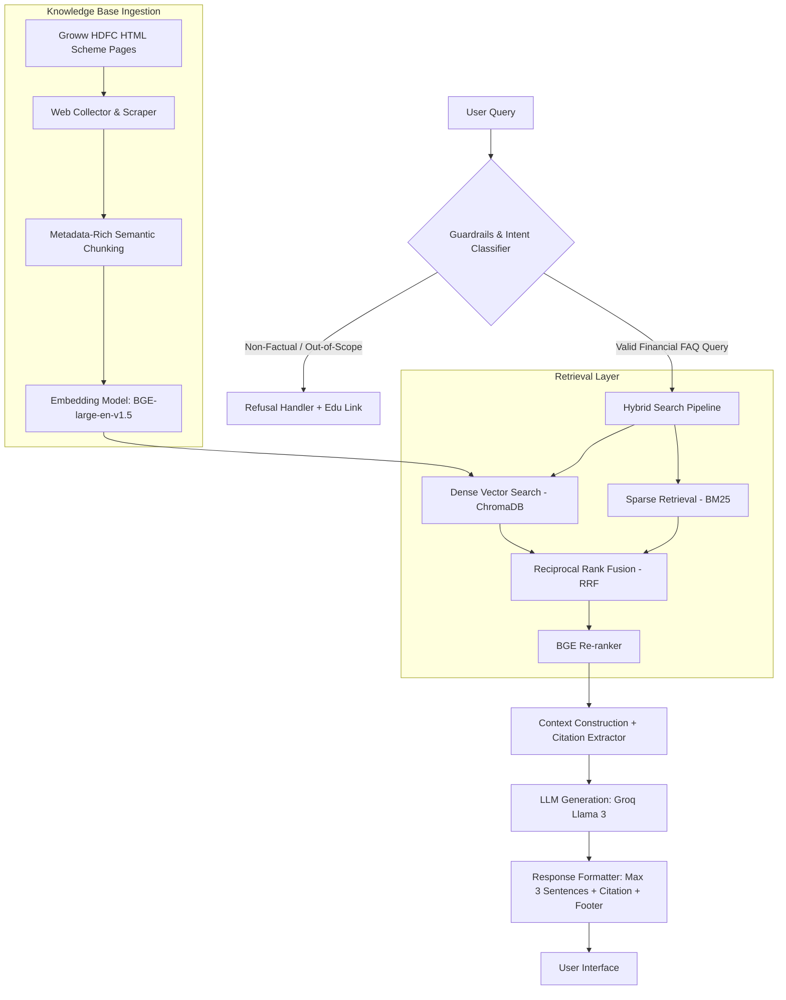

# Project Context: Mutual Fund FAQ Assistant (Facts-Only Q&A)

## 1. Executive Summary & Overview
The **Mutual Fund FAQ Assistant** is a trustworthy, compliant, and facts-only Retrieval-Augmented Generation (RAG) system inspired by the design philosophy and high-trust user experience of **Groww**. 

In the financial domain, particularly mutual funds, accuracy, compliance, and verifiability are paramount. Standard Large Language Models (LLMs) are prone to hallucinations, speculation, and the unintended generation of financial advice—which carries significant regulatory, legal, and reputation risks under SEBI (Securities and Exchange Board of India) and AMFI guidelines. 

This chatbot solves these problems by grounding its knowledge base exclusively in verified, official Asset Management Company (AMC) scheme pages on Groww. It acts strictly as a **facts-only FAQ assistant**, prioritizing high factual precision over conversational creativity.

---

## 2. Business Objectives & Constraints
The assistant is designed to meet strict operational and compliance standards:
*   **Facts-Only Mandate:** Refuse to give any subjective opinions, direct investment suggestions, or return projections.
*   **Regulatory Compliance:** Strictly avoid providing investment advice or recommendations.
*   **Data Integrity & Privacy:** Never collect, store, or process Personally Identifiable Information (PII) or sensitive banking details (PAN, Aadhaar, bank accounts, OTPs, or contact information).
*   **Complete Transparency:** Ground every answer in a single, verifiable, official source link accompanied by a clear "Last Updated" timestamp to establish user trust.

---

## 3. Targeted Scope: Selected AMC & Corpus Definition
The assistant is customized for **HDFC Mutual Fund**, a leading and highly trusted AMC in India with a wide range of retail investment schemes.

### 3.1. Selected Schemes (Diverse Portfolio Mix)
1.  **HDFC Mid-Cap Opportunities Fund (Direct - Growth)**
    *   *Source URL:* `https://groww.in/mutual-funds/hdfc-mid-cap-fund-direct-growth`
2.  **HDFC Small Cap Fund (Direct - Growth)**
    *   *Source URL:* `https://groww.in/mutual-funds/hdfc-small-cap-fund-direct-growth`
3.  **HDFC Gold ETF Fund of Fund (Direct - Growth)**
    *   *Source URL:* `https://groww.in/mutual-funds/hdfc-gold-etf-fund-of-fund-direct-plan-growth`
4.  **HDFC Multi-Cap Fund (Direct - Growth)**
    *   *Source URL:* `https://groww.in/mutual-funds/hdfc-multi-cap-fund-direct-growth`
5.  **HDFC Large-Cap Fund (Direct - Growth)**
    *   *Source URL:* `https://groww.in/mutual-funds/hdfc-large-cap-fund-direct-growth`

### 3.2. Curated Document Corpus
To feed our retrieval pipeline, we utilize the official public pages from Groww for each of these HDFC schemes, containing details on:
*   **Expense Ratios & Exit Loads:** The direct plan exit load structures and annual management charges.
*   **Minimum Transaction Thresholds:** Minimum SIP amount and minimum lumpsum purchase limits.
*   **Riskometer Classifications:** High-accuracy risk levels assigned to each fund.
*   **Benchmark Indices:** Benchmark index associated with each scheme.
*   **Asset Allocations:** Holding distributions and top sector concentrations.

---

## 4. Key Functional & Non-Functional Requirements

### 4.1. Core FAQ Answering Capabilities
The assistant must deliver highly specific, objective answers to queries regarding:
*   **Expense Ratios:** Up-to-date direct plan expense percentages.
*   **Exit Load Details:** Specific withdrawal charges and timelines (e.g., "1% exit load if redeemed within 1 year").
*   **Minimum Transaction Thresholds:** Minimum SIP amount and minimum lumpsum purchase amounts.
*   **Riskometer Classifications:** High-accuracy risk levels (e.g., Very High, High, Moderate).
*   **Benchmark Indices:** Benchmark index associated with the scheme (e.g., Nifty Midcap 150 TRI).
*   **Asset Allocations:** Top stock holdings and sector allocations for each fund.

### 4.2. Response Constraints (Strict Formatting)
To guarantee readability, conciseness, and precision, the system must enforce these constraints on every successful response:
1.  **Length Limit:** **Maximum of 3 sentences**. No long paragraphs or walls of text.
2.  **Explicit Citation:** **Exactly one citation link** directing to the official Groww source page.
3.  **Footer Metadata:** Always conclude the answer with:
    `Last updated from sources: <dd-mmm-yyyy>`

### 4.3. Refusal and Fallback System
For queries that step outside of factual boundaries, the model must employ a strict refusal policy:
*   **Advisory / Speculative Refusals:** If a user asks *"Should I invest in HDFC Mid-Cap?"* or *"Which HDFC fund is better?"*, the system must politely refuse:
    > *"I am a facts-only assistant and cannot offer investment advice, recommendations, or performance comparisons. For educational guidelines, please refer to the official [AMFI Investor Education Page](https://www.amfiindia.com/investor-corner)."*
*   **Performance Comparison Queries:** If a user requests returns or comparisons, the chatbot must refuse calculations and direct them to the factsheet:
    > *"I cannot calculate returns or compare performances. You can view official historical returns on the [Groww HDFC Mid-Cap Opportunities Fund Page](https://groww.in/mutual-funds/hdfc-mid-cap-fund-direct-growth)."*
*   **Out-of-Scope Queries:** Refuse non-mutual-fund queries gracefully, reinforcing the assistant's boundaries.

---

## 5. System & RAG Architecture Blueprint
The architecture utilizes a modular RAG flow designed for factual correctness and verifiable citation tracking.



### 5.1. Data Ingestion & Processing
*   **Parsing Dense Formats:** Extract HTML scheme details, tabular information, and sector lists.
*   **Smart Chunking:** Implement **Recursive Character Text Chunking** (chunk size: 800 tokens, overlap: 150 tokens) while maintaining document structure. Ensure tables are preserved in Markdown format.
*   **Metadata Tagging:** Tag every text chunk with:
    *   `source_url`: The exact Groww URL for that scheme.
    *   `document_type`: "Groww Scheme Page".
    *   `scheme_name`: e.g., "HDFC Small Cap Fund".
    *   `page_section`: e.g., "Exit Load & Fees".
    *   `last_updated`: Timestamp of the ingestion.

### 5.2. Advanced Hybrid Retrieval Strategy
To ensure the chatbot never misses crucial numeric parameters:
*   **Dense Search:** Semantic vector database queries (e.g., ChromaDB) using high-quality BGE embedding models.
*   **Sparse Search:** BM25 lexical keyword matching to retrieve exact numeric matches and terms (e.g., "exit load", "lock-in").
*   **Reranking:** Implement **BGE-Reranker-Large** to evaluate the top 10 retrieved chunks, selecting only the top 3 highly relevant snippets.

### 5.3. LLM Prompting & Compliance Engineering
A heavily constrained System Prompt ensures the LLM sticks strictly to the context:
*   Inject the retrieved chunks along with their exact source URLs.
*   Enforce a zero-tolerance policy for generating answers outside the context.
*   Force the model to refuse advisory queries, returning the standardized refusal message.
*   Validate output length (<= 3 sentences) and verify that the single citation link matches the retrieved metadata exactly.

---

## 6. Minimal User Interface Specifications
The interface is designed with a clean, high-trust, and minimalist layout inspired by Groww:
*   **Welcome Message:** Simple, clean greeting defining what the assistant can do.
*   **Quick-Start Prompts:** Clickable example cards for user convenience:
    1.  *"What is the exit load for HDFC Mid-Cap Opportunities Fund?"*
    2.  *"What is the minimum SIP amount for HDFC Small Cap Fund?"*
    3.  *"Which benchmark index does HDFC Large-Cap Fund follow?"*
*   **Sticky Disclaimer:** Highly visible banner at the top or bottom:
    ⚠️ **Facts-only. No investment advice or recommendations.**
*   **Clean Output Display:** High contrast response layout presenting the short text, an elegant clickable citation button, and the source update date.

---

## 7. Implementation Roadmap & Success Criteria

```
┌─────────────────────────────────────────────────────────────┐
│ PHASE 0: INGESTION & PARSING (HTML, Tables, Metadata)       │
└──────────────────────────────┬──────────────────────────────┘
                               ▼
┌─────────────────────────────────────────────────────────────┐
│ PHASE 1: RETRIEVAL PIPELINE (Vector DB, BM25, Reranking)     │
└──────────────────────────────┬──────────────────────────────┘
                               ▼
┌─────────────────────────────────────────────────────────────┐
│ PHASE 2: GENERATION & PROMPT COMPLIANCE (Groq/Llama3)       │
└──────────────────────────────┬──────────────────────────────┘
                               ▼
┌─────────────────────────────────────────────────────────────┐
│ PHASE 3: GUARDRAILS & REFUSAL LOGIC (Advisory Filtering)     │
└──────────────────────────────┬──────────────────────────────┘
                               ▼
┌─────────────────────────────────────────────────────────────┐
│ PHASE 4: GITHUB ACTIONS INGESTION SCHEDULER                  │
└──────────────────────────────┬──────────────────────────────┘
                               ▼
┌─────────────────────────────────────────────────────────────┐
│ PHASE 5: MINIMAL STREAMLIT UI & CITATION VALIDATION          │
└─────────────────────────────────────────────────────────────┘
```

### 7.1. Success Criteria (Evaluation Metrics)
1.  **Faithfulness (Ragas Metric):** Zero hallucination. 100% of generated claims must be directly traceable to the retrieved chunks.
2.  **Refusal Rate:** 100% adherence to blocking investment advice, return comparisons, or subjective evaluations.
3.  **Citation Accuracy:** 100% of successfully answered queries must include a single, valid, working Groww citation link.
4.  **Formatting Compliance:** Zero answers exceeding the 3-sentence constraint.
